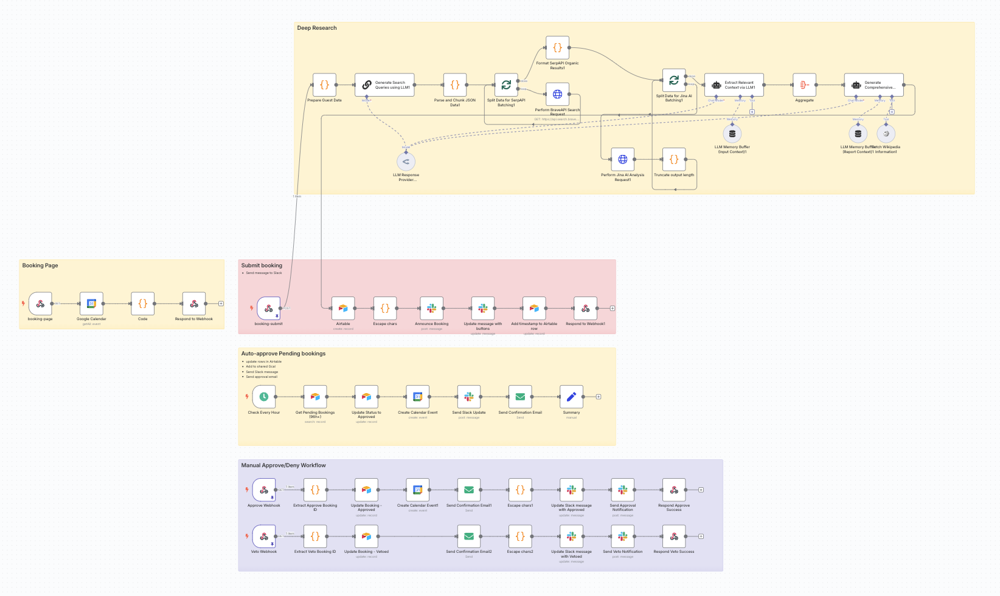
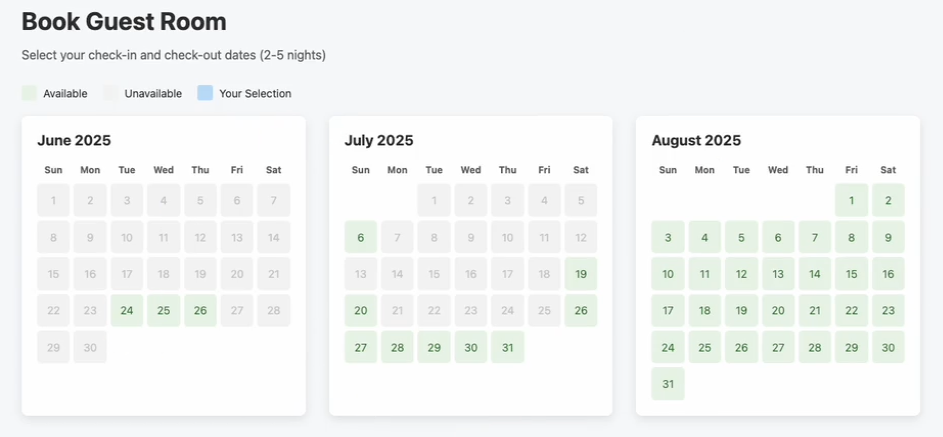
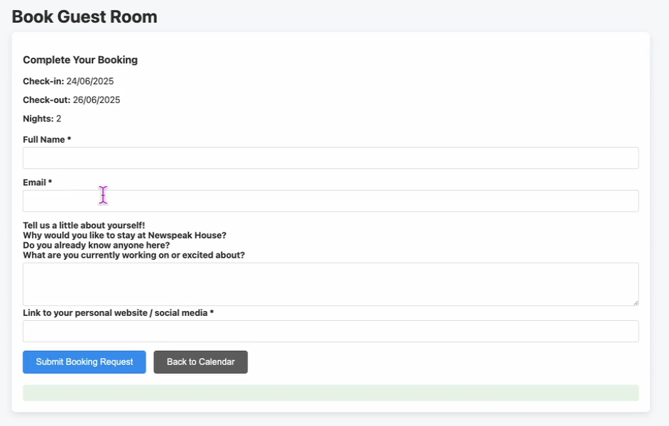
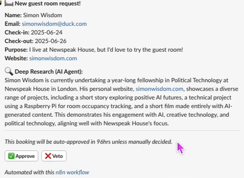
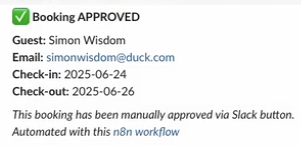
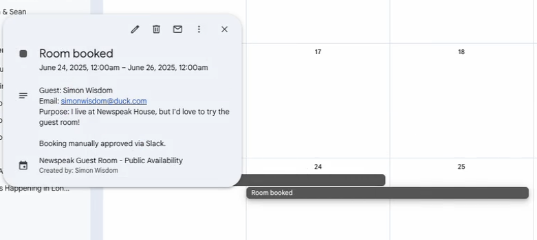

# Booking & Approval Workflow for n8n

This repository contains a powerful, generic n8n workflow designed to manage resource bookings that require an approval process. It's a perfect template for handling guest rooms, community spaces, equipment rentals, or any other shared resource.

The system provides a user-friendly, web-based calendar for booking, an internal review process with AI-powered research, and automated notifications via Slack and email.

## ✨ Features

*   **Dynamic HTML Booking Form:** A public-facing webpage with a calendar showing real-time availability.
*   **Team Approval via Slack:** New requests are posted to a Slack channel with "Approve" and "Reject" buttons, allowing your team to make decisions directly from Slack.
*   **AI-Powered Applicant Research (Optional):** Automatically performs web research on the applicant to provide a concise summary for your team, helping them make informed decisions.
*   **Scheduled Auto-Approval:** If a request isn't manually handled within a set time, it can be automatically approved to ensure nothing is missed.
*   **Automated Notifications:** Keeps both the applicant and your team informed with confirmation/rejection emails and Slack status updates.
*   **Centralized Management:** Uses Airtable as a single source of truth to track all booking requests and their statuses.

## ⚙️ How It Works

The workflow is divided into several key stages:

1.  **Booking Request:** A user visits the public booking page, selects available dates, and fills out a form with their details.

    
    _The booking form, showing available dates on the calendar._

    
    _The applicant fills in their details to complete the request._

2.  **Internal Review:**
    *   The request is saved as a "Pending" entry in an Airtable base.
    *   The optional AI agent researches the applicant and generates a summary.
    *   A message is posted in a designated Slack channel with the booking details, research summary, and `Approve` / `Reject` buttons.

    
    _The team receives a Slack notification with details and approval buttons._

3.  **Manual Decision:**
    *   A team member clicks "Approve" or "Reject" in Slack.
    *   This triggers a webhook in n8n, which updates the Airtable record, creates a Google Calendar event (if approved), and sends a confirmation/rejection email to the applicant.

    
    _The original Slack message is updated to show the booking is confirmed._

    
    _An event is automatically created in Google Calendar upon approval._

4.  **Auto-Approval (Scheduled):**
    *   A scheduled trigger runs hourly to find any "Pending" requests that have passed their review deadline.
    *   If found, it automatically approves the booking and triggers the same confirmation steps (calendar event, email, etc.).

## 📋 Prerequisites

Before you begin, you will need accounts for the following services:

*   **n8n:** A running instance (self-hosted or [n8n cloud](https://n8n.cloud/)).
*   **Airtable:** A free or paid account.
*   **Slack:** A workspace where you have permission to install apps.
*   **Google Calendar:** A Google account to create a dedicated calendar for bookings.
*   **Email Service:** An SMTP provider or an n8n-supported email service for sending notifications.
*   **(Optional) AI & Search APIs:**
    *   An LLM provider like **OpenRouter**, **OpenAI**, or **Anthropic**.
    *   A web search API like **SerpApi** or **Brave Search** for the research agent.

## 🚀 Setup Instructions

Follow these steps to get the workflow up and running.

### 1. Set Up Airtable

This is your database. Create a new **Airtable Base** with a single table. The workflow expects the fields listed below.

| Field Name           | Field Type             | Description / Notes                                                                                               |
| -------------------- | ---------------------- | ----------------------------------------------------------------------------------------------------------------- |
| `Guest Name`         | Single line text       | The applicant's full name.                                                                                        |
| `Email`              | Email                  | The applicant's email address.                                                                                    |
| `Check-in Date`      | Date                   | The start date of the booking.                                                                                    |
| `Check-out Date`     | Date                   | The end date of the booking.                                                                                      |
| `Purpose`            | Long text              | The purpose of the booking, from the form.                                                                        |
| `Personal Website`   | URL                    | The applicant's website/social media link.                                                                        |
| `Automated Research` | Long text              | Stores the summary from the AI agent.                                                                             |
| `Status`             | Single select          | Options: `Pending`, `Approved`, `Rejected`, `Cancelled`.                                                          |
| `Slack Message ID`   | Single line text       | Stores the timestamp of the Slack message for later updates.                                                      |
| `Rejection Reason`   | Single line text       | (Optional) A field to note why a request was rejected.                                                            |
| `Auto-Approve At`    | **Formula**            | **Crucial for auto-approval.** Use the formula: `DATEADD({Created}, 4, 'days')`. Adjust the number (`4`) as needed. |
| `Created`            | Created time           | Automatically records when the request was submitted.                                                             |

### 2. Create a Google Calendar

Create a new, dedicated Google Calendar for these bookings. Go to its settings and find the **Calendar ID** (it usually looks like an email address).

### 3. Create a Slack App

1.  Go to [api.slack.com/apps](https://api.slack.com/apps) and create a new app from scratch.
2.  In "OAuth & Permissions," add the following Bot Token Scopes:
    *   `chat:write`
    *   `chat:write.public`
    *   `channels:read` (to find channels)
    *   `users:read` (to find users, if notifying a person)
3.  Install the app to your workspace and copy the **Bot User OAuth Token**.
4.  Invite the bot to the private or public channel you want to use for notifications (e.g., `/invite @your-bot-name`).

### 4. Configure n8n Credentials

In your n8n instance, go to the "Credentials" section and add new credentials for:
*   **Airtable**
*   **Slack** (using the Bot User OAuth Token)
*   **Google Calendar** (using OAuth2)
*   Your **Email Service** (e.g., SMTP)
*   **(Optional)** Your LLM provider and Search API provider.

### 5. Import and Configure the Workflow

1.  Download the `workflow.json` file from this repository.
2.  In your n8n instance, import the downloaded file.
3.  Go through the workflow and replace all placeholders (`[PLACEHOLDER]`) with your actual values. Pay close attention to the following nodes:

| Node Name                     | Parameter / Field                    | Value to Input                                                                        |
| ----------------------------- | ------------------------------------ | ------------------------------------------------------------------------------------- |
| **Google Calendar** (all)     | `Calendar ID`                        | Your Google Calendar ID.                                                              |
| **Code** (HTML form)          | `submissionWebhookUrl`               | Your n8n `booking-submit` webhook URL.                                                |
| **Airtable** (all)            | `Base ID` / `Table ID`               | Your Airtable Base and Table IDs.                                                     |
| **Slack** (all)               | `Channel ID` / `User ID`             | The ID of the Slack channel/user for notifications.                                   |
| **Email** (all)               | `From Email`, `Reply-To Email`       | Your desired sender/reply-to addresses.                                               |
| **Update message with buttons**| `url` (in the `blocksUi` parameter) | Replace `[N8N_INSTANCE_URL]` with your n8n instance URL for the `approve`/`reject` links. |
| **(Optional) LLM/Search Nodes**| Credentials / Model                  | Select the credentials and models you configured.                                     |

### 6. Activate the Workflow

1.  Click the "Active" toggle in the top-right of the n8n editor.
2.  The webhook URLs are now live. The `booking-page` webhook URL is your public form.
3.  The `Check Every Hour` schedule trigger is now active and will run as configured.

## 🎨 Customization

This workflow is a template. You are encouraged to customize it!

*   **Booking Rules:** Open the `Code` node to change `minStay` and `maxStay` values.
*   **Form Content:** Edit the HTML inside the `Code` node to change the form questions and text.
*   **Notification Wording:** Edit the text in all `Slack` and `Send Email` nodes to match your organization's tone.
*   **AI Prompts:** Modify the system messages in the `Generate Search Queries` and `Generate Comprehensive Research Report` nodes to refine the AI's behavior.
*   **Auto-Approval Time:** Adjust the formula in your Airtable `Auto-Approve At` field and update the corresponding text in the `Announce Booking` Slack message.

## ⚖️ License

This project is licensed under the MIT License. See the [LICENSE](LICENSE) file for details.